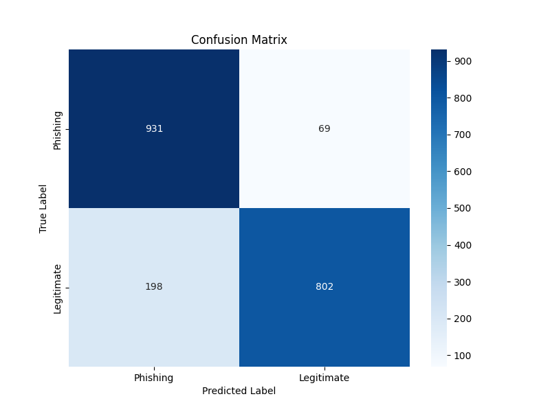

# 🛡 Phishing Detection ML Service

This directory contains the machine learning component of the Phishing Website Detector. The service uses a logistic regression model trained on domain-specific features to provide rapid preliminary assessment of potential phishing websites.

## 🎯 Model Performance

Based on our evaluation metrics, the model demonstrates strong performance in phishing detection:

- **Accuracy**: 90.25%
- **ROC AUC**: 0.962

### Detailed Metrics

| Class      | Precision | Recall | F1-Score | Support |
|------------|-----------|--------|----------|---------|
| Legitimate | 0.882     | 0.929  | 0.905    | 1000    |
| Phishing   | 0.925     | 0.876  | 0.900    | 1000    |

### Visualization of Results

#### Confusion Matrix


#### ROC Curve


#### Precision-Recall Curve


## 🔍 Feature Analysis

The model utilizes a carefully selected set of features extracted from URLs and domain names. Here are the top 10 most important features based on absolute coefficient values:

1. **URL Length** (-12.200)
2. **HTTPS** (4.633)
3. **Domain Length** (1.910)
4. **Domain Registration Length** (1.274)
5. **DNS Record** (1.030)
6. **Server Form Handler** (0.799)
7. **Links in Scripts** (0.692)
8. **Subdomains** (0.601)
9. **Iframe Redirection** (0.477)
10. **Prefix-Suffix in Domain Name** (-0.471)

### Feature Importance Visualization


For a complete view of all features:


## 💻 Components

1. **Data Processing** (`preprocess.py`):
   - Feature extraction
   - Data normalization
   - Train/validation/test split

2. **Model Training** (`train.py`):
   - SMOTE for class balancing
   - Model training and validation
   - Hyperparameter tuning

3. **Evaluation** (`evaluate.py`):
   - Performance metrics calculation
   - Feature importance analysis
   - Model validation

4. **API Server** (`server.py`):
   - Flask-based REST API
   - Real-time prediction endpoint
   - Error handling and logging

## 🔧 API Reference

### Prediction Endpoint
```http
POST /api/customScan
```

Request body:
```json
{
    "url": "example.com"
}
```

Response:
```json
{
    "result": "Safe",
    "safetyScore": 95.5,
    "probabilities": {
        "legitimate": 95.5,
        "phishing": 4.5
    }
}
```

## 🚀 Training Pipeline

1. **Data Collection** (`fetch_dataset.py`):
   ```bash
   python fetch_dataset.py
   ```

2. **Preprocessing** (`preprocess.py`):
   ```bash
   python preprocess.py
   ```

3. **Model Training** (`train.py`):
   ```bash
   python train.py
   ```

4. **Evaluation** (`evaluate.py`):
   ```bash
   python evaluate.py
   ```

## 🧪 Testing

To test individual URLs:
```bash
python test_model.py --domain example.com
```

For batch testing:
```bash
python test_model.py --file urls.txt
```

## 📊 Model Versioning

The current production model is stored in `models/logistic_model.joblib`. Each trained model includes:

- Model weights
- Feature scaling parameters
- Feature names and importance scores